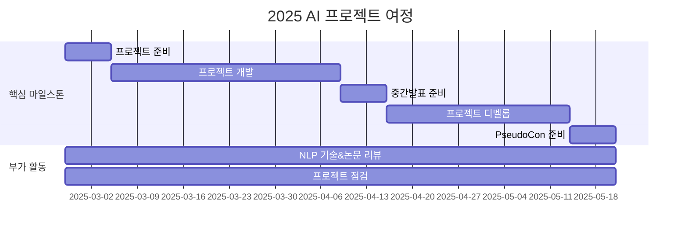

<h1 align="center"> 깃헙에 NLP 잔디심기 Season 6 </h1>

<div align="center">
<a href="https://pseudo-lab.com"></a>
<a href="https://discord.gg/EPurkHVtp2"></a>
<a href="https://github.com/Pseudo-Lab/10th-template/stargazers"></a>
<a href="https://github.com/Pseudo-Lab/10th-template/graphs/contributors"></a>
<a href="https://hits.seeyoufarm.com"></a>
</div>
<br>

<!-- sheilds: https://shields.io/ -->
<!-- hits badge: https://hits.seeyoufarm.com/ -->

> Welcome to GJS6 repository! We aim to catch up with the latest NLP techniques and leverage them to create projects. Join us in advancing the field of NLP through open collaboration and innovation!

## 🌟 프로젝트 목표 (Project Vision)
_"이론에서 실전까지, 함께 성장하는 AI 실험실"_  
- NLP & LLM 이론 리뷰 및 학습
- 비판적 사고 능력 향상
- 나만의 프로젝트 진행
- 오픈소스 정신을 바탕으로 한 지식 공유 문화


## 🧑 역동적인 팀 소개 (Dynamic Team)

| 역할          | 이름 |  기술 스택 배지                                                                 | 주요 관심 분야                          |
|---------------|------|-----------------------------------------------------------------------|----------------------------------------|
| **Project Manager** | 박수형 |     | NLP / LLM / RAG / MoE |
| **Member** | 레오나르도 다빈치 |   | 데이터 파이프라인 설계                  |


## 🚀 프로젝트 로드맵 (Project Roadmap)



## 🛠️ 우리의 개발 문화 (Our Development Culture)
**우리의 개발 문화**  
```python
class CollaborationFramework:
    def __init__(self):
        self.tools = {
            'communication': 'Discord / Kakaotalk',
            'version_control': 'GitHub Projects',
            'ci/cd': 'GitHub Actions'
        }
    
    def workflow(self):
        return """주간 사이클:
        1️⃣ 수요일: NLP 기술 리뷰 & 프로젝트 내용 발표 (Live Share)"""
```


## 📈 성과 지표 (Achievement Metrics)
**2024 주요 KPI**  
| 지표                     | 목표치 | 현재 달성률 |
|--------------------------|--------|-------------|
| 커밋 수                  | 1,200  | 83%         |
| 이슈 해결률              | 95%    | 89%         | 
| 기술 블로그 게시물       | 24편   | 15편        |
| 오픈소스 기여도          | 8회    | 5회         |


## 💻 주차별 활동 (Activity History)

| 날짜 | 내용 | 발표자 | 
| -------- | -------- | ---- |
| 2025/02/ | OT       |      |
| 2025/02/ |  Part 1. | 미정 | 
| 2025/02/ |  Part 2. | 미정 | 
| 2025/02/ |  Part 3. | 미정 | 
| 2025/03/ |  Part 4. | 미정 | 
| 2025/03/ |  Part 5. | 미정 | 


## 💡 학습 자원 (Learning Resources)
**우리가 만든 지식 허브**  
- [LLM 핸드북](https://springcoolers.github.io/llm-handbook/_contents/intro.html): 다양한 LLM 지식과 이론을 접할 수 있는 공간 (제작 중)

## 🌱 참여 안내 (How to Engage)
**팀원으로 참여하시려면 러너 모집 기간에 신청해주세요.**  
- 링크 (준비중)
- NLP와 LLM에 대한 사전 지식이 있어야합니다.
- 기본적으로 참여하고자 하시는 분은 하고싶은 프로젝트 하나 씩 준비해주셔야합니다.

**누구나 청강을 통해 모임을 참여하실 수 있습니다.**  
1. 특별한 신청 없이 정기 모임 시간에 맞추어 디스코드 [#Room-YL](https://discordapp.com/channels/944032730050621450/1068784805413654579) 채널로 입장
2. Magical Week 중 행사에 참가
3. Pseudo Lab 행사에서 만나기

## About Pseudo Lab 👋🏼</h2>

[Pseudo-Lab](https://pseudo-lab.com/) is a non-profit organization focused on advancing machine learning and AI technologies. Our core values of Sharing, Motivation, and Collaborative Joy drive us to create impactful open-source projects. With over 5k+ researchers, we are committed to advancing machine learning and AI technologies.

<h2>Contributors 😃</h2>
<a href="https://github.com/Pseudo-Lab/10th-template/graphs/contributors">
  
</a>
<br><br>

<h2>License 🗞</h2>

This project is licensed under the [MIT License](https://opensource.org/licenses/MIT).
