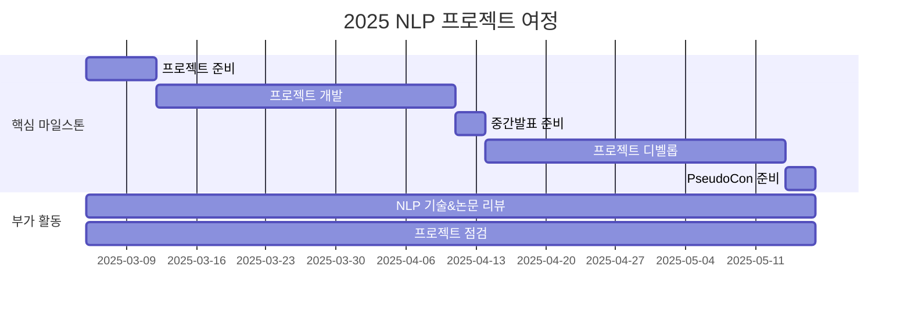

<h1 align="center"> 깃헙에 NLP 잔디심기 Season 6 </h1>

<div align="center">
<a href="https://pseudo-lab.com"></a>
<a href="https://discord.gg/EPurkHVtp2"></a>
<a href="https://github.com/Pseudo-Lab/10th-template/stargazers"></a>
<a href="https://github.com/Pseudo-Lab/10th-template/graphs/contributors"></a>
<a href="https://hits.seeyoufarm.com"></a>
</div>
<br>

<!-- sheilds: https://shields.io/ -->
<!-- hits badge: https://hits.seeyoufarm.com/ -->

> Welcome to GJS6 repository! We aim to catch up with the latest NLP techniques and leverage them to create projects. Join us in advancing the field of NLP through open collaboration and innovation!

## 🤔 왜 깃잔심이 필요할까요?
- 함께라서 성장할 수 있습니다
    - 혼자서는 쉽게 게을러질 수 있지만, **함께 하는 커뮤니티는 지속적인 동기부여**를 제공합니다.
- 서로의 시각과 지식으로 보완
    - 다양한 배경의 사람들이 모여 **더 나은 해결책을 찾고, 깊이 있는 학습**을 합니다.
- 모여서 더 즐겁게, 창의적으로
    - 팀으로 도전하며 **아이디어 교류와 실험이 자연스럽게 성장할 수 있는 경험**이 됩니다.

## 🧐 어떻게 이루어질까요?
- 이론에서 실전까지 성장하는 공간
    - **이론을 실용적인 AI 솔루션으로 바꾸며 실전 경험**을 쌓습니다.
- 비전과 경험을 공유하며 협력
    - **리더들이 모여 깊이 있는 연구와 협력을 통해** 더 큰 목표를 향해 나아갑니다.
- 동기부여와 즐거운 학습 문화
    - **지식을 공유하고 피드백을 주며** 지속적인 성장을 함께 이룹니다.

## 🤓 구체적으로 어떤 일이 이루어지나요?
- NLP & LLM 이론 학습
    - 최신 연구 동향을 **체계적으로 학습**합니다.
- 비판적 사고 및 문제 해결
    - **비판적 사고를 통해 문제 해결 능력**을 키웁니다.
- 개별 및 협업 프로젝트 진행
    - **실전 경험**을 쌓고 창의적 아이디어를 구현합니다.
- 지식 공유 문화
    - **성과와 배움을 공유**하며 커뮤니티 성장을 돕습니다.

**깃잔심은 함께 배우고 도전하며, 창의적이고 즐거운 분위기 속에서 실용적인 가치를 만들어가는 공동체**입니다.  
단순한 공부 모임이 아니라, **비전과 가치를 공유하고 서로를 자극하며 실제 영향력을 만들어가는 리서치 팀**이 바로 깃잔심입니다.

## 🧑 역동적인 팀 소개 (Dynamic Team)

| 역할          | 이름 |  기술 스택 배지                                                                 | 주요 관심 분야                          |
|---------------|------|-----------------------------------------------------------------------|----------------------------------------|
| **Project Manager** | [박수형](https://github.com/Coding-Child) |     | NLP / LLM / RAG / MoE |
| **전 Builder** | [정한결](https://github.com/HangryDev) |   | 데이터 파이프라인 설계                  |


## 🚀 프로젝트 로드맵 (Project Roadmap)



## 🛠️ 우리의 개발 문화 (Our Development Culture)
**우리의 개발 문화**  
```python
class CollaborationFramework:
    def __init__(self):
        self.tools = {
            'communication': 'Discord / Kakaotalk',
            'version_control': 'GitHub Projects',
            'ci/cd': 'GitHub Actions'
        }
    
    def workflow(self):
        return """주간 사이클:
        1️⃣ 수요일: NLP 기술 리뷰 & 프로젝트 내용 발표 (Live Share)"""
```

## 💻 주차별 활동 (Activity History)
논문 발표의 경우 예시 일정이며, 발표자에 따라 리뷰 논문이 바뀔 수 있습니다
| 날짜 | 내용 | 발표자 | 
| -------- | -------- | ---- |
| 2025/03/05 |  OT       | 박수형 |
| 2025/03/12 |  [s1: Simple test-time scaling](https://arxiv.org/pdf/2501.19393) | 미정 | 
| 2025/03/19 |  [TensorLLM: Tensorising Multi-Head Attention for Enhanced Reasoning and Compression in LLMs](https://arxiv.org/pdf/2501.15674) | 미정 |
| 2025/03/26 |  ⭐Magical Week⭐ | 미정 |
| 2025/04/02 |  [LIMO: Less Is More for Reasoning](https://arxiv.org/pdf/2502.03387) | 미정 | 
| 2025/04/09 |  🧑‍🏫프로젝트 중간 발표🧑‍🏫 | 미정 | 
| 2025/04/16 |  [CoAT: Chain-of-Associated-Thoughts Framework for Enhancing Large Language Models Reasoning](https://arxiv.org/pdf/2502.02390) | 미정 | 
| 2025/04/23 |  [Syntriever: How to Train Your Retriever with Synthetic Data from LLMs](https://arxiv.org/pdf/2502.03824) | 미정 | 
| 2025/04/30 |  ⭐Magical Week⭐ | 미정 |
| 2025/05/07 |  [Demystifying Long Chain-of-Thought Reasoning in LLMs](https://arxiv.org/pdf/2502.03373) | 미정 |
| 2025/05/14 |  [Rethinking Mixture-of-Agents: Is Mixing Different Large Language Models Beneficial?](https://arxiv.org/pdf/2502.00674) | 미정 |
| 2025/05/17 |  🎉PseudoCon 2025🎉 | 미정 |

## 🌱 참여 안내 (How to Engage)
**팀원으로 참여하시려면 러너 모집 기간에 신청해주세요.**  
- 링크 (준비중)
- NLP와 LLM에 대한 사전 지식이 있어야합니다.
- **기본적으로 참여하고자 하시는 분은 하고싶은 프로젝트 하나씩 준비**해주셔야합니다.

**누구나 청강을 통해 모임을 참여하실 수 있습니다.**  
1. 특별한 신청 없이 정기 모임 시간에 맞추어 디스코드 [#Room-YL](https://discordapp.com/channels/944032730050621450/1068784805413654579) 채널로 입장
2. Magical Week 중 행사에 참가
3. Pseudo Lab 행사에서 만나기
4. 청강을 통해 모임에 참여하신 분들은 Discussion의 청강 후기 페이지에서 청강에 대한 후기 공유 부탁드립니다.

## About Pseudo Lab 👋🏼</h2>

[Pseudo-Lab](https://pseudo-lab.com/) is a non-profit organization focused on advancing machine learning and AI technologies. Our core values of Sharing, Motivation, and Collaborative Joy drive us to create impactful open-source projects. With over 5k+ researchers, we are committed to advancing machine learning and AI technologies.

<h2>Contributors 😃</h2>
<a href="https://github.com/Pseudo-Lab/10th-template/graphs/contributors">
  
  
</a>
<br><br>

<h2>License 🗞</h2>

This project is licensed under the [MIT License](https://opensource.org/licenses/MIT).
