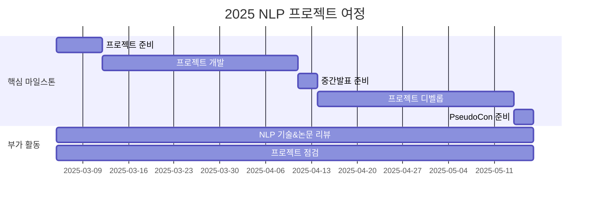

<h1 align="center"> 깃헙에 NLP 잔디심기 Season 6 </h1>

<div align="center">
<a href="https://pseudo-lab.com"></a>
<a href="https://discord.gg/EPurkHVtp2"></a>
<a href="https://github.com/Pseudo-Lab/GJS6/stargazers"></a>
<a href="https://github.com/Pseudo-Lab/GJS6/graphs/contributors"></a>
<a href="https://hits.seeyoufarm.com"></a>
</div>
<br>

<!-- sheilds: https://shields.io/ -->
<!-- hits badge: https://hits.seeyoufarm.com/ -->

> Welcome to GJS6 repository! We aim to catch up with the latest NLP techniques and leverage them to create projects. Join us in advancing the field of NLP through open collaboration and innovation!

## ❓ 깃잔심이 무엇인가요?
**깃잔심은 함께 배우고 도전하며, 창의적이고 즐거운 분위기 속에서 실용적인 가치를 만들어가는 공동체**입니다.  
단순한 공부 모임이 아니라, **비전과 가치를 공유하고 서로를 자극하며 실제 영향력을 만들어가는 리서치 팀**이 바로 깃잔심입니다.

## 🤔 왜 깃잔심이 필요할까요?
- 함께라서 성장할 수 있습니다
    - 혼자서는 쉽게 게을러질 수 있지만, **함께 하는 커뮤니티는 지속적인 동기부여**를 제공합니다.
- 서로의 시각과 지식으로 보완
    - 다양한 배경의 사람들이 모여 **더 나은 해결책을 찾고, 깊이 있는 학습**을 합니다.
- 모여서 더 즐겁게, 창의적으로
    - 팀으로 도전하며 **아이디어 교류와 실험이 자연스럽게 성장할 수 있는 경험**이 됩니다.

## 🧐 어떻게 이루어질까요?
- ❗ United Research는 무엇인가요?
    - 여러 스터디가 다같이 시너지를 내서 좀 더 높은 목표를 지향하고 스터디의 산출물을모아서 큰 임팩트를 만들어내어 많은 사람들에게 영향력을 줄 수 있게하는 팀들을 뜻합니다!
- 🪴 우리 깃잔심은...
    - Paper Reading Club: NLP 분야의 최신 업데이트(논문/툴/개발 문서)를 수집하여 함께 토론을 하며 최신 동향을 파악합니다.
        - 매주 주말에 일주일 동안 업데이트 된 NLP 기술과 LLM 소식들을 분배하여 평가합니다.
        - 분배를 통해 평가한 최신 업데이트들은 각자 돌아가며 가볍게 얘기하고 이에 대해 서로의 생각을 들어보는 시간을 가집니다.  
      (※ LLM Engineering Handbook에 사용된 문서 요약 봇을 통해 요약된 소식을 분배 받아 평가합니다.)  
      (※ 한사람당 약 1~2분 내외로 얘기하고 토론하는 방식으로 1시간 소요 예정입니다.)
    - Project Execution & Presentation
        - 깃잔심의 모든 구성원은 각자 또는 팀을 이뤄 자유롭게 프로젝트를 주제를 정하여 NLP 관련 AI 솔루션을 제작합니다.
        - 프로젝트의 기획과 발견한 문제점, 공유하고 싶은 내용 등을 시즌 중간에 발표를 하고 이에 대해 다른 멤버들에게 피드백을 받아 디벨롭을 진행합니다.
        - 시즌 마무리 시점에 최종적으로 완성된 프로젝트를 세상에 발표합니다.
    - Growth & Feedback Culture
        - 구성원 간 피드백: 매주 진행되는 프로젝트 진행상황 발표 과정에서 서로 피드백을 주고받으며 발전할 수 있는 문화를 지향합니다.
        - 개인 성장 목표: 비판적 사고 능력 향상/발표 능력 향상/프로젝트 기획 및 문제 해결 능력 등 각 멤버가 프로젝트를 진행하며 얻고자하는 목표를 설정하고 이를 공유합니다.
(※ 전반적으로 프로젝트 주제는 상관이 없습니다! 자신의 공부를 위한 것이기 때문에 큰 규모의 프로젝트가 아니어도 괜찮습니다. 공동의 목표인 지식 향상을 이룰 수 있는 프로젝트이면 충분합니다!)

## 🤓 구체적으로 어떤 일이 이루어지나요?
- 첫 모임 날짜 & 시간 & 장소
    - 날짜: 3월 5일
    - 시간: 오후 7시
    - 장소: [언커먼 갤러리](https://naver.me/xJiBtwoX)
      
- 정기 모임 시간 & 장소
    - 시간: 수요일 오후 7시 30분
    - 장소: 오프라인: 디스코드 [#ROOM-YL](https://discord.gg/EPurkHVtp2)

- 학습 활동 및 활동 방법
    - 학습 자료
        - 스터디 활동 방법  
        💡 **오픈 아카데미** 형태(=청강 가능)로 진행하며, 발표자료는 가짜연구소를 통해 **공개적으로 배포할** 수 있도록 할 예정입니다

        1. **진행 & 발표**
            - 출석체크를 위해 실명으로 참여 부탁드립니다.
            - 온라인에서 여러분을 만나는 환경이므로 웹캠을 꼭 준비해 주세요
            - 발표자는 OT 날 선정 (참여 인원에 따라 1인 1-2회 정도 발표 예상)
        2. **학습 활동**
            - 담당한 이론을 정리하고, 발표를 준비합니다.
            - 개인 프로젝트를 진행하고, 진행사항을 공유합니다 (선택)
            - 발표 후 LLM Engineering handbook 템플릿 형태로 정리, 업로드합니다. (필수)
            - 학습 내용에 대한 질문 및 공유
            - 최종 발표회: 프로젝트 진행하시는 분들은 시즌 완성된 내용을 데모합니다. (발표는 선택, 참여는 필수)
        3. 신청 전 주의사항
            - 시즌 마지막에 최종 발표회 겸 뒷풀이 있습니다. 널찍한 파티룸 빌려서 진행합니다! 시즌 중간에 미리 회비를 걷고 진행하겠습니다. (공간 대여료만 인당 2-3만원 선, 총합 5-6만원 선으로 예상됩니다)
      
## 🧑 역동적인 팀 소개 (Dynamic Team)

| 역할          | 이름 |  기술 스택 배지                                                                 | 주요 관심 분야                          |
|---------------|------|-----------------------------------------------------------------------|----------------------------------------|
| **Project Manager** | [박수형](https://github.com/Coding-Child) |     | NLP / LLM / RAG / MoE |
| **전 Builder** | [정한결](https://github.com/HangryDev) | | NLP |
| Member | [정영상](https://www.linkedin.com/in/video-jeong?utm_source=share&utm_campaign=share_via&utm_content=profile&utm_medium=android_app) |        | NLP / LLM / RAG / MoE |
| Member | 신서현 | | NLP |
| Member | [황윤희](https://www.linkedin.com/in/meuni/) |    | NLP / LLM / RAG / MultiAgent |
| Member | 김지한 | | NLP |


## 🚀 프로젝트 로드맵 (Project Roadmap)



## 🛠️ 우리의 개발 문화 (Our Development Culture)
**우리의 개발 문화**  
```python
class CollaborationFramework:
    def __init__(self):
        self.tools = {
            'communication': 'Discord / Kakaotalk',
            'version_control': 'GitHub Projects',
            'ci/cd': 'GitHub Actions'
        }
    
    def workflow(self):
        return """주간 사이클:
        1️⃣ 수요일: NLP 기술 리뷰 & 프로젝트 내용 발표 (Live Share)"""
```

## 💻 주차별 활동 (Activity History)
논문 발표의 경우 예시 일정이며, 발표자에 따라 리뷰 논문이 바뀔 수 있습니다
| 날짜 | 내용 | 발표자 | 
| -------- | -------- | ---- |
| 2025/03/05 |  OT       | 박수형 |
| 2025/03/12 |  [s1: Simple test-time scaling](https://arxiv.org/pdf/2501.19393) | 박수형 | 
| 2025/03/19 |  [TensorLLM: Tensorising Multi-Head Attention for Enhanced Reasoning and Compression in LLMs](https://arxiv.org/pdf/2501.15674) | 미정 |
| 2025/03/26 |  ⭐Magical Week⭐ | 미정 |
| 2025/04/02 |  [LIMO: Less Is More for Reasoning](https://arxiv.org/pdf/2502.03387) | 미정 | 
| 2025/04/09 |  🧑‍🏫프로젝트 중간 발표🧑‍🏫 | 미정 | 
| 2025/04/16 |  [CoAT: Chain-of-Associated-Thoughts Framework for Enhancing Large Language Models Reasoning](https://arxiv.org/pdf/2502.02390) | 미정 | 
| 2025/04/23 |  [Syntriever: How to Train Your Retriever with Synthetic Data from LLMs](https://arxiv.org/pdf/2502.03824) | 미정 | 
| 2025/04/30 |  ⭐Magical Week⭐ | 미정 |
| 2025/05/07 |  [Demystifying Long Chain-of-Thought Reasoning in LLMs](https://arxiv.org/pdf/2502.03373) | 미정 |
| 2025/05/14 |  [Rethinking Mixture-of-Agents: Is Mixing Different Large Language Models Beneficial?](https://arxiv.org/pdf/2502.00674) | 미정 |
| 2025/05/17 |  🎉PseudoCon 2025🎉 | 미정 |

## 🌱 참여 안내 (How to Engage)
**팀원으로 참여하시려면 러너 모집 기간에 신청해주세요.**  
- 링크 (준비중)
- NLP와 LLM에 대한 사전 지식이 있어야합니다.
- **기본적으로 참여하고자 하시는 분은 하고싶은 프로젝트 하나씩 준비**해주셔야합니다.

**누구나 청강을 통해 모임을 참여하실 수 있습니다.**  
1. 특별한 신청 없이 정기 모임 시간에 맞추어 디스코드 [#Room-YL](https://discordapp.com/channels/944032730050621450/1068784805413654579) 채널로 입장
2. Magical Week 중 행사에 참가
3. Pseudo Lab 행사에서 만나기
4. 청강을 통해 모임에 참여하신 분들은 Discussion의 청강 후기 페이지에서 청강에 대한 후기 공유 부탁드립니다.

## 지원서 필수 작성 사항
- 깃헙에 NLP 잔디심기 Season 6에 지원하고자 할때 **하고싶은 프로젝트 주제와 자세한 기획**을 작성해주시기바랍니다.

## About Pseudo Lab 👋🏼</h2>

[Pseudo-Lab](https://pseudo-lab.com/) is a non-profit organization focused on advancing machine learning and AI technologies. Our core values of Sharing, Motivation, and Collaborative Joy drive us to create impactful open-source projects. With over 5k+ researchers, we are committed to advancing machine learning and AI technologies.

<h2>Contributors 😃</h2>
<a href="https://github.com/Pseudo-Lab/10th-template/graphs/contributors">
  
  
</a>
<br><br>

<h2>License 🗞</h2>

This project is licensed under the [MIT License](https://opensource.org/licenses/MIT).
